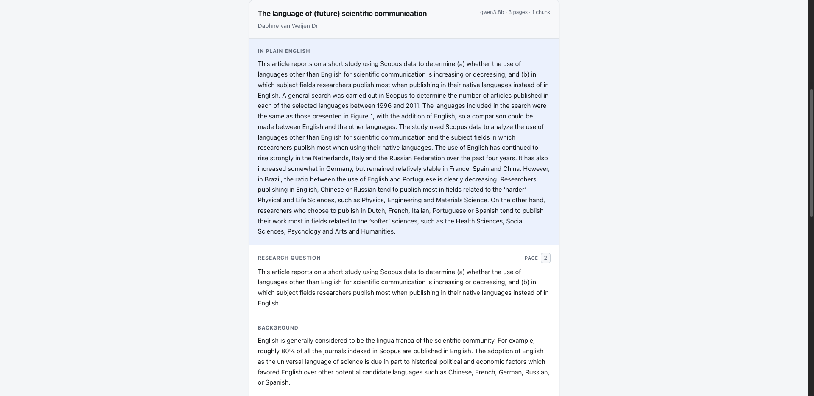
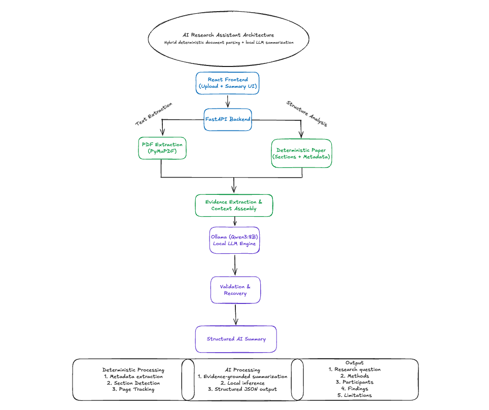

# AI Paper Reader

Upload an academic PDF, get a structured page-cited summary, and ask questions answered only from that paper - all on your own machine, with local Ollama models.

---

## Why I built this project

As someone working in a psychology research lab, I regularly read and analyze academic papers. Extracting the research question, methods, participants, findings, and limitations can be time-consuming, especially when reviewing multiple papers or preparing a literature review.

My background at the intersection of neuroscience, psychology, and data science motivated me to explore how large language models could support this workflow. I wanted to build an assistant that could produce a structured overview in one step rather than requiring repeated prompts to a general-purpose chatbot.

Accuracy was equally important. A research assistant is only useful when it preserves the meaning of the source material. For that reason, this project combines deterministic document parsing with a locally hosted language model, using the model to condense evidence rather than allowing it to freely invent or rediscover the paper's structure.

Long term, I hope to build AI systems that help researchers spend less time searching through information and more time generating scientific insights.

---

## Features

- Upload and validate academic PDF files
- Extract text page by page without permanently storing the uploaded document
- Detect paper titles, authors, headings, sections, and page boundaries
- Generate structured summaries covering the research question, background, methods, participants, findings, and limitations
- Ground page references in deterministic document parsing rather than model-generated citations
- Run inference locally using Ollama and Qwen3, with no paid API required
- Ask a question about the paper and get an answer grounded only in its text,
  with the pages the evidence came from
- Abstain deterministically when the paper does not support an answer, without
  calling the generation model at all
- Handle local-model failures through validation, recovery logic, and deterministic fallbacks

---

## Screenshots

### 1. Upload a research paper


### 2. Generate a structured AI summary



### 3. Review methods, findings, and limitations


> _Ask the Paper has no screenshot yet. Add one at
> `docs/screenshots/ask.png` and link it here._

---

## Architecture



---

## Technology stack

| Layer | Technology |
|---|---|
| Backend | Python 3.9+, FastAPI, Uvicorn |
| PDF parsing | PyMuPDF (`fitz`) |
| Validation | Pydantic v2 |
| HTTP client | httpx (async) |
| LLM runtime | Ollama, `qwen3:8b` (configurable) |
| Frontend | React 19, Vite 8, JavaScript, plain CSS |
| Config | python-dotenv |
| Testing | pytest, ESLint |

No CSS framework, no state-management library, no LLM orchestration framework.

---

## End-to-end workflow

1. **Upload** — the browser posts a PDF to `POST /upload`. The backend validates it, extracts text page by page with PyMuPDF, and returns page count, character count, a 3,000-character preview and the full page array. The file is never persisted.
2. **Parse** — on `POST /summary`, running heads and footers are detected across pages and removed, then the document is split into sections. Each section records the pages it spans.
3. **Package** — sections are mapped onto summary fields: `Research question` to research question; `Participants` to participants; `Data collection and analysis` plus `Method` to methods; `Findings`/`Results` plus `Discussion` to key findings; explicit limitations to limitations. The limitation and key-finding filters run here.
4. **Condense** — one call asks the model to restate each evidence package. It is told which fields were supplied and that claiming a supplied field is missing is wrong.
5. **Map** — chunk-by-chunk extraction runs **only** for fields no heading covered. A fully structured paper skips this stage, costing two model calls instead of *N+1*.
6. **Reduce** — one call assembles the final structure and writes the plain-English summary and confidence notes. Condensed values are marked `VERIFIED` and must be carried through.
7. **Recover** — for each field the pipeline takes the first available of: the reduce output, the condensed evidence, the chunk notes, a deterministic condenser over the raw section text. Page numbers are overwritten with parser values and clamped to the document's real page range.
8. **Render** — the frontend displays the summary in sections with page badges. Fields with no supporting text render as "Not stated in the paper".

Asking a question reuses the same extracted pages: the paper is embedded once
and cached in memory, then each question is embedded, ranked against the paper,
checked for answerability, and either answered from selected evidence or
declined without calling the generation model.

---

## Project structure

```
ai-paper-reader/
├── backend/
│   ├── main.py             # FastAPI app and the four endpoints
│   ├── config.py           # environment configuration
│   ├── schemas.py          # Pydantic models and recovery-first validators
│   ├── sections.py         # heading detection, section boundaries, field mapping,
│   │                       #   limitation and key-finding filters
│   ├── metadata.py         # running heads, title and author extraction
│   ├── condensers.py       # deterministic fallback condensers
│   ├── summarizer.py       # condense -> map -> reduce -> recover pipeline
│   ├── ollama_client.py    # async Ollama HTTP client, JSON repair, retries
│   ├── diagnostics.py      # SUMMARY_DEBUG logging helpers
│   ├── fixtures.py         # synthetic paper-shaped test fixture
│   ├── test_main.py        # test suite
│   ├── evaluations/        # question sets: real_papers/ and synthetic_fixtures/
│   ├── requirements.txt
│   └── .env.example
├── frontend/
│   ├── index.html
│   ├── vite.config.js
│   ├── eslint.config.js
│   └── src/
│       ├── main.jsx
│       ├── App.jsx
│       ├── index.css            # design tokens and shared button styles
│       ├── pages/               # Home.jsx, Home.css
│       ├── components/          # StatusBadge, UploadCard, SummaryCard (+ CSS)
│       └── services/api.js      # health, upload, summary
├── .github/workflows/ci.yml
├── README.md
└── LICENSE
```

---

## Installation

**Prerequisites:** Python 3.9+, Node.js 18+, and [Ollama](https://ollama.com) running locally.

Both models are required:

```bash
ollama pull qwen3:8b          # summaries and grounded answer generation
ollama pull nomic-embed-text  # retrieval embeddings for Ask the Paper
```

**Backend**

```bash
cd backend
python -m venv venv
source venv/bin/activate          # Windows: venv\Scripts\activate
pip install -r requirements.txt
cp .env.example .env
```

**Frontend**

```bash
cd frontend
npm install
```

---

## Running locally

Start Ollama, then run the backend and frontend in separate terminals.

```bash
# terminal 1 - backend
cd backend
source venv/bin/activate
uvicorn main:app --reload
# -> http://127.0.0.1:8000   (interactive docs at /docs)
```

```bash
# terminal 2 - frontend
cd frontend
npm run dev
# -> http://localhost:5173
```

The backend allows CORS from `http://localhost:5173` only.

### Configuration

All backend settings live in `backend/.env` (see `backend/.env.example`). The
frontend reads `VITE_API_BASE_URL`, which defaults to `http://127.0.0.1:8000`.
To point it elsewhere, copy `frontend/.env.example` to `frontend/.env.local`
and edit it.

| Variable | Default | Purpose |
|---|---|---|
| `OLLAMA_BASE_URL` | `http://localhost:11434` | Ollama HTTP API |
| `OLLAMA_MODEL` | `qwen3:8b` | Model used for every call |
| `OLLAMA_CONNECT_TIMEOUT` | `10` | Fail fast when Ollama is down |
| `OLLAMA_READ_TIMEOUT` | `300` | Local inference is slow |
| `OLLAMA_TEMPERATURE` | `0` | Extraction, not creative writing |
| `OLLAMA_TOP_P` | `0.9` | Sampling cutoff |
| `OLLAMA_NUM_PREDICT_MAP` | `2048` | Token budget for chunk extraction |
| `OLLAMA_NUM_PREDICT_REDUCE` | `3072` | Token budget for condense and reduce |
| `SUMMARY_CHUNK_CHARS` | `12000` | Chunk size ceiling |
| `SUMMARY_CHUNK_PAGES` | `6` | Pages per chunk ceiling |
| `SUMMARY_DEBUG` | `false` | Verbose pipeline diagnostics |
| `FRONTEND_ORIGIN` | `http://localhost:5173` | Origin allowed by CORS |
| `OLLAMA_EMBED_MODEL` | `nomic-embed-text` | Embedding model for retrieval |
| `OLLAMA_EMBED_BATCH` | `16` | Chunks per embedding request |
| `OLLAMA_NUM_PREDICT_ANSWER` | `768` | Token budget for one grounded answer |
| `ASK_MAX_EVIDENCE_CHUNKS` | `4` | Most passages sent to the model per question |
| `ASK_SELECTION_POOL` | `12` | Ranked passages evidence selection chooses from |
| `ASK_EMBEDDING_CACHE_SIZE` | `4` | Embedded papers kept in memory |

---

## API endpoints

| Method | Path | Description |
|---|---|---|
| `GET` | `/` | Service banner |
| `GET` | `/health` | Health check |
| `POST` | `/upload` | Multipart PDF to page-by-page text |
| `POST` | `/summary` | `{filename, pages}` to structured summary |
| `POST` | `/ask` | `{question, filename, pages}` to a grounded answer with page citations |

### `POST /upload`

`multipart/form-data` with a single field named `file`.

```json
{
  "filename": "paper.pdf",
  "page_count": 10,
  "character_count": 45000,
  "text_preview": "first 3000 characters...",
  "pages": [{ "page_number": 1, "text": "..." }]
}
```

| Status | Condition |
|---|---|
| `400` | Not a PDF, empty file, or unreadable/corrupt PDF |
| `413` | Larger than 20 MB |
| `422` | Valid PDF with no extractable text (likely scanned) |

### `POST /summary`

Takes the `filename` and `pages` returned by `/upload`.

| Status | Condition |
|---|---|
| `400` | No pages supplied |
| `422` | Supplied pages contain no extractable text |
| `502` | Malformed, empty, or unparseable model output |
| `503` | Ollama unreachable, or the configured model is not installed |
| `504` | Ollama timed out |

### `POST /ask`

Answers one question using only the supplied paper. Takes the `filename` and
`pages` returned by `/upload`, so the PDF is never re-uploaded. Each question is
independent; there is no conversation history.

The deterministic pipeline decides what counts as evidence, which pages it came
from, and whether the paper can support an answer at all. The model is only
asked to phrase an answer from evidence it has been handed - it cannot retrieve,
choose its own sources, or produce a page number.

| Status | Meaning |
|---|---|
| `supported` | The paper contains evidence for the answer |
| `partially_supported` | The paper addresses the question only in part; the answer is hedged |
| `not_supported` | The paper does not contain enough evidence. **No generation call is made** |

**Supported example**

```json
{
  "status": "supported",
  "answer": "The study included 20 participants.",
  "sources": [
    {
      "page": 4,
      "chunk_id": "p0004-ce89043d91d2",
      "section": "participants",
      "evidence": "The participants were 20 Polish university students of English philology..."
    }
  ],
  "confidence_note": "Answer based only on retrieved evidence from the paper."
}
```

**Unsupported example** — asking a bibliometric paper about human participants:

```json
{
  "status": "not_supported",
  "answer": "The paper does not provide enough evidence to answer this question.",
  "sources": [],
  "confidence_note": "No sufficiently supported answer was found in the paper."
}
```

Abstention is reached before any model call, so an unanswerable question costs
nothing and cannot produce a fabricated answer. If the model returns an answer
that cannot be traced back to a supplied passage, that answer is discarded
rather than published.

| Status | Condition |
|---|---|
| `400` | Empty question, or no pages supplied |
| `422` | Supplied pages contain no extractable text |
| `502` | Malformed or empty model output |
| `503` | Ollama unreachable, or a required model is not installed |
| `504` | Ollama timed out |

---

## Example summary output

> **Note:** this response was captured from the automated test suite using a
> **synthetic paper-shaped fixture** (`backend/fixtures.py`) and a stubbed model.
> It illustrates the response contract, not the output quality of `qwen3:8b` on a
> real paper.

```json
{
  "filename": "nurses.pdf",
  "model": "qwen3:8b",
  "page_count": 10,
  "chunk_count": 2,
  "summary": {
    "title": "Supporting newly qualified nurses through the transition to clinical practice: a qualitative interview study",
    "authors": ["Jane A. Fielding", "Marcus O. Reyes", "Priya N. Shah"],
    "research_question": "How newly qualified nurses experience structured mentorship during their first year on acute wards, and what helps or hinders it.",
    "background": "Earlier preceptorship studies relied on single-site surveys with low response rates.",
    "methods": "Semi-structured interviews of 45 to 70 minutes, analysed with reflexive thematic analysis and coded independently by two researchers.",
    "participants_or_data": "Eighteen newly qualified nurses aged 21 to 34, purposively sampled from three acute NHS trusts.",
    "key_findings": [
      "Knowing a mentor was on the same shift reduced reported anxiety.",
      "Nurses calibrated whether to ask questions against how busy the ward appeared.",
      "Repeated supervised practice was gradually internalised as independent judgement."
    ],
    "limitations": [
      "The sample was drawn from three trusts in one region.",
      "Each nurse was interviewed once, so change over the year relies on retrospective accounts.",
      "The sample was homogeneous in age and predominantly female."
    ],
    "plain_english_summary": "Eighteen newly qualified nurses were interviewed about their first year on acute wards. Having a mentor present on the same shift mattered more than formal scheduling, and supervised practice slowly became independent confidence.",
    "confidence_notes": "Based on a single round of interviews at three sites in one region; no quantitative outcome measures were reported.",
    "source_pages": {
      "research_question": [4],
      "methods": [4, 5],
      "key_findings": [6, 7, 8, 9],
      "limitations": [9, 10]
    }
  }
}
```

`source_pages` is written by the section parser, never by the model. Any field with no supporting text is returned as the literal string `"Not stated in the paper"`.

---

## Engineering decisions

**Deterministic first, model second.** The earliest version asked the model to discover every field inside unconstrained chunks, and it routinely dropped fields printed under an explicit heading. Parsing structure in code and handing the model labelled evidence to condense removed an entire class of failure, and made a well-structured paper cost two model calls instead of *N+1*.

**Every model output has a deterministic fallback.** If the condense step fails, times out, or returns nothing for a field that had evidence, a purpose-built condenser summarises the raw section text instead. The model can degrade the *wording* of a summary but not its *content*.

**The model synthesises; it never retrieves.** For Ask the Paper the pipeline
selects the evidence, the model receives only that text plus opaque passage ids,
and every id it returns is checked against what was sent. Unknown ids are
dropped, and an answer citing none of the supplied passages is discarded.

**Provenance never comes from the model.** `source_pages` is written by the section parser and clamped to the document's real page range, so a citation cannot point at a page that does not exist.

**Validators recover rather than discard.** Local models return `{"value": {"text": "..."}}` or a bare string where an object was requested. The Pydantic validators unwrap these shapes before falling back to a sentinel, and any fallback is logged so the loss is visible in development.

**Two sentinels, not one.** The map stage says `"Not stated in this chunk"`; only the final answer may say `"Not stated in the paper"`. Conflating them is how a fact on page 4 disappears because page 7 did not mention it.

**Filters encode what a paper says about itself.** A limitation is only accepted from an explicit limitations section or an explicit cue, and prescriptive sentences are rejected from key findings. Both rules reject rather than interpret, which keeps them auditable and testable as truth tables.

**Structured outputs with graceful degradation.** JSON schemas are sent to Ollama with `$ref`/`$defs` inlined, since nested definitions are most likely to break grammar conversion. If a build rejects the schema or the `think: false` option, the client retries once and remembers, so the extra round trip is paid once per process.

**Reasoning-model handling.** `qwen3` emits `<think>` blocks; the client disables thinking where supported and strips those blocks (including unclosed ones) and code fences before parsing.

**Diagnostics that cannot leak.** `SUMMARY_DEBUG` reports page ranges, field names, timings and values truncated to 60 characters. A test asserts that paper text never reaches the logs.

**Python 3.9 compatible.** All annotations use `typing` forms rather than PEP 604 unions or PEP 585 builtin generics, verified by an AST scan over every backend module.

---

## Testing

The backend suite stubs `httpx`, so **no model and no running Ollama are required**.

```bash
cd backend && python -m pytest      # 94 tests
```

```bash
cd frontend
npm run lint
npm run build
```

Both run on every push and pull request via `.github/workflows/ci.yml`
(Python 3.9 and 3.12, Node 20).

Question sets for the answerability harness live in `backend/evaluations/`,
split into `real_papers/` and `synthetic_fixtures/`:

```bash
cd backend
python answerability_eval.py "/path/to/paper.pdf" \
  --eval evaluations/real_papers/publication_language.json
```

Coverage includes:

- All four endpoints, including every upload rejection path
- Title and author extraction against journal-header, arXiv and minimal front matter
- Section boundaries, numbered and run-in headings, and multi-page section ranges
- The limitation filter and the key-findings filter as parametrised truth tables
- Deterministic condensers for research question, participants and methods
- Every Ollama failure mode: unreachable, model missing, timeout, empty response, malformed JSON, rejected options
- Malformed model output recovery in the Pydantic validators

The central regression test uses a synthetic paper-shaped fixture: journal running head, page number, article-type label, three-line title, byline, affiliation, email and DOI on page 1; explicit `Research question`, `Participants` and `Data collection and analysis` headings on page 4; findings on pages 6-8; and an explicit limitations paragraph on pages 9-10 containing both a recommendation and a result that must be rejected. It runs twice, once with a cooperative model and once with a model that returns `"Not stated in the paper"` for every field. **Both runs must produce the same field coverage.**

---

## Future roadmap

None of the following exist yet:

- Question answering over an uploaded paper, grounded in the extracted sections
- Multi-paper comparison
- OCR for scanned PDFs, which are currently rejected
- Figure and table extraction
- Export to Markdown and BibTeX
- Streaming progress in the UI for long local inference runs
- Reference parsing and citation graphs
- Model selection from the frontend
- Split test suite and a CI workflow running pytest, ESLint and the production build

---

## License

MIT - see [LICENSE](LICENSE).
